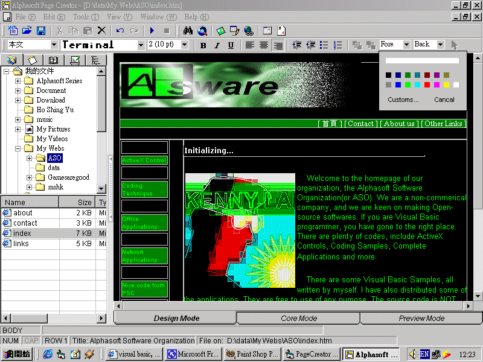

<div align="center">

## A\-lphasoft:Page Creator 2\! The biggest WYSIWYG HTML Editor, with great User Interface\!\!\!


</div>

### Description

Page Creator 2 is no longer here. I am developing a completely new Page Creator 3. see it at

<p></p>

<p>http://www.planet-source-code.com/vb/scripts/ShowCode.asp?txtCodeId=30120&lngWId=1</P>
 
### More Info
 


<span>             |<span>
---                |---
**Submitted On**   |2001-10-03 17:28:06
**By**             |[Kenny Lai, Lai Ho Wa](https://github.com/Planet-Source-Code/PSCIndex/blob/master/ByAuthor/kenny-lai-lai-ho-wa.md)
**Level**          |Advanced
**User Rating**    |5.0 (220 globes from 44 users)
**Compatibility**  |VB 5\.0, VB 6\.0
**Category**       |[Complete Applications](https://github.com/Planet-Source-Code/PSCIndex/blob/master/ByCategory/complete-applications__1-27.md)
**World**          |[Visual Basic](https://github.com/Planet-Source-Code/PSCIndex/blob/master/ByWorld/visual-basic.md)
**Archive File**   |[A\-lphasoft3033910222001\.zip](https://github.com/Planet-Source-Code/kenny-lai-lai-ho-wa-a-lphasoft-page-creator-2-the-biggest-wysiwyg-html-editor-with-great-u__1-26854/archive/master.zip)


### Source Code

```
Page Creator 2 is no longer here. I am developing a completely new Page Creator 3. see it at
<p></p>
<p>http://www.planet-source-code.com/vb/scripts/ShowCode.asp?txtCodeId=30120&lngWId=1</P>
```

